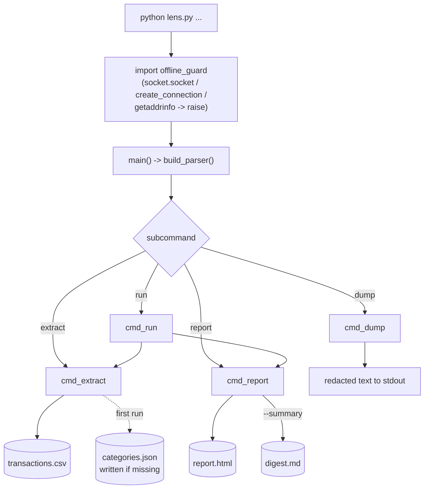
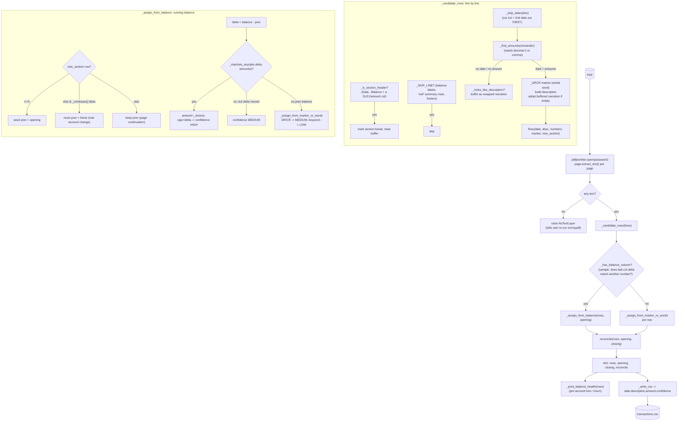
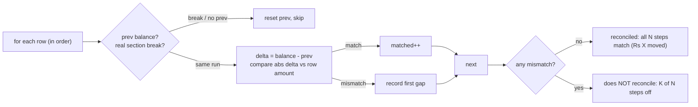
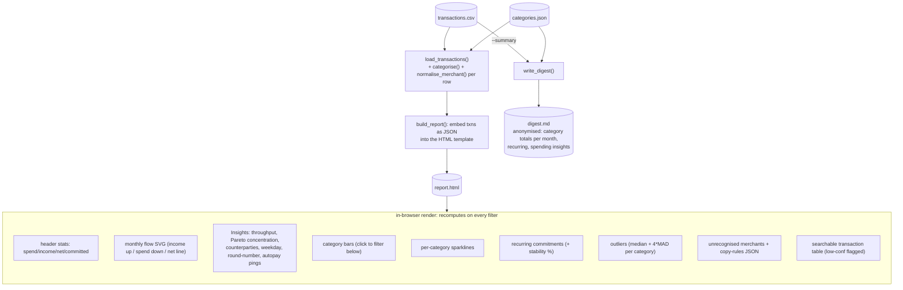
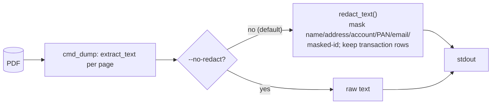

# Code flow

How a PDF becomes a report, module by module. Diagrams are Mermaid (render on
GitHub and most Markdown viewers). Every arrow is plain function calls — no
network, no LLM. The first import in `lens.py` is `offline_guard`, which patches
`socket` to raise, so nothing downstream can reach out.

## Module map

| File | Role |
| --- | --- |
| [offline_guard.py](offline_guard.py) | Blocks the network on import (first thing `lens.py` does) |
| [lens.py](lens.py) | CLI entry: `extract` / `report` / `run` / `dump` |
| [extractor.py](extractor.py) | Stage 1 — PDF text → transaction `Row`s + reconciliation |
| [categorise.py](categorise.py) | Direction-aware keyword categoriser + merchant normaliser |
| [analysis.py](analysis.py) | Arithmetic over the CSV: totals, recurring, outliers, insights, balance health |
| [reporter.py](reporter.py) | Stage 2 — CSV → self-contained `report.html` |
| [digest.py](digest.py) | `--summary` → anonymised `digest.md` |
| [redact.py](redact.py) | Strips identity fields from `dump` output |
| [make_test_pdf.py](make_test_pdf.py) / [run_tests.py](run_tests.py) / [render_check.py](render_check.py) | Test-only |

## Entry → commands

- `run` is just `extract` then `report`, passing the reconciliation result
  through so the report banner can show it.
- `--password` is a shared option accepted before *or* after the subcommand.

## Stage 1 — extract (PDF → transactions.csv)

Driver: `extract_pdf()` in [extractor.py](extractor.py). Correctness rule:
never invent a number, never silently invert a sign, always report when the
parse doesn't add up.

### Reconciliation (`reconcile`)

Two *independent* measurements per row are compared: the printed balance delta
vs. the printed Credit/Debit figure. If they always agree, nothing was dropped
or duplicated. Needs no opening-balance label and works across pages and
multiple accounts (`_continues()` tells a page-repeat header from a real
account change).

## Stage 2 — report (transactions.csv → report.html)

Driver: `build_report()` in [reporter.py](reporter.py). Data is embedded in the
page as JSON; **all aggregation runs in the browser in vanilla JS**, so the
month-range and category filters recompute everything live. Zero external refs
(no `http` substring anywhere — verify with `grep http report.html`).

### What computes where

| Concern | Function | Consumed by |
| --- | --- | --- |
| Category of a row (direction-aware) | `categorise()` | report, digest |
| Merchant key (drops single-letter tokens) | `normalise_merchant()` | recurring, insights |
| Month × category totals | `monthly_category_totals()` | digest |
| Recurring (merchant + stable amount + regular gap + stability) | `detect_recurring()` | digest (report mirrors it in JS) |
| Outliers (median + 4×MAD) | `detect_outliers()` | report mirrors it in JS |
| Concentration / counterparties / weekday / pings | `spending_insights()` | digest (report mirrors it in JS) |
| Per-account low balance / churn | `balance_health()` | `extract`/`run` console |

## dump (debugging path)

## Test path

`run_tests.py` builds a synthetic HDFC PDF with `make_test_pdf.py`, runs the
pipeline, and asserts exact-paisa reconciliation, that dropping a row breaks
reconciliation, correct Income categorisation, the CREDIT/date traps, zero
`http` in the report, and — via `render_check.py` in a separate (guard-free)
process — a headless render with no console errors and every section populated.
